# Project Plan

## Product Goal

Build a LAN remote browser controller:

1. A desktop server runs on Windows or macOS.
2. The server embeds a persistent browser profile with cookies, cache, and local
   storage.
3. Android and iOS clients discover the server automatically and remotely
   operate the browser.
4. The long-term product direction is a TV-like remote control experience for
   video sites, with site-specific playback controls.

## Phase 1: Runnable Vertical Slice

Status: in development.

- Python/PySide6 desktop server.
- Qt WebEngine browser with persistent profile storage.
- Server-announced UDP discovery.
- UDP control channel.
- Optional password authentication.
- Basic browser commands:
  - navigate to URL
  - click by viewport coordinate
  - click by CSS selector
  - type into focused element
  - set text by CSS selector
  - scroll
  - close current page
  - back, forward, reload
  - query status
- Browser preview stream:
  - 360p default
  - selectable up to 1080p
  - 30fps default
  - selectable 20-60fps range
  - tap preview to click remote page
  - optional WebRTC/H.264 signaling path; WebRTC failures are reported directly
- Python development client for protocol testing.

Success criteria:

- A client can discover the server on the LAN.
- A client can authenticate when a password is configured.
- A client can open a URL, click, input text, and scroll.
- Browser cookies and site storage survive server restarts.

## Phase 2: Mobile Client MVP

Recommended stack: Flutter.

Rationale:

- One codebase for Android and iOS.
- Good support for UDP sockets through packages.
- Easy to build a remote-control UI with touchpad, keyboard, and quick actions.

Client MVP screens:

- Discovery list.
- Pair/connect screen.
- Remote touchpad.
- URL/search input.
- Keyboard/text send.
- Basic navigation controls.

## Phase 3: Reliable Remote UX

- Add command retry and idempotency rules around UDP.
- Add low-rate browser preview snapshots.
- Add viewport size reporting.
- Add gesture commands:
  - drag
  - long press
  - pinch/zoom if feasible
- Add better focus and keyboard handling.
- Add server tray icon and startup options.

## Phase 4: Video Site Modes

- Add site adapters for common video websites.
- Detect known pages and expose remote controls:
  - play/pause
  - seek
  - volume
  - fullscreen
  - next episode
  - subtitle/audio selection where possible
- Keep adapters optional and isolated from the generic browser controls.

## Phase 5: Packaging

- Windows installer or portable zip.
- macOS app bundle.
- Signed builds if distribution requires it.
- Local network permission notes for macOS.
- QR code pairing for mobile clients.

## Architecture

```mermaid
flowchart LR
  Discovery["Server Discovery Socket"] -- "UDP offer announce" --> Mobile["Android/iOS Client"]
  Mobile -- "UDP auth/control" --> Control["Server Control Socket"]
  Control --> Auth["Session/Auth Layer"]
  Auth --> BrowserCtl["Browser Controller"]
  BrowserCtl --> QtWeb["Qt WebEngine Browser"]
  QtWeb --> Profile["Persistent Browser Profile"]
```

## Key Engineering Choices

- Use UDP for both discovery and control to match the product requirement.
- Use JSON datagrams for debuggability during the early phase.
- Add sequence/request IDs from the beginning so reliability can evolve without
  a protocol break.
- Keep browser actions as high-level commands rather than exposing arbitrary JS
  by default.
- Support optional password mode. Passwords are never sent directly over the
  network.

## Risks

- UDP is unreliable. The first version acknowledges commands, but mobile clients
  still need retry behavior.
- Some websites block synthetic DOM events. Later versions may need native input
  injection through Qt events for those cases.
- iOS background networking and LAN permissions need product testing.
- Video sites vary heavily and may change behavior often.
